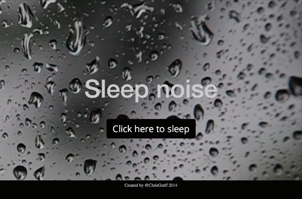

# Pink Noise Generator  

> [Example](http://mvpacemaker.com) Pink noise generator using javascript, web-audio-api, bootstrap, and Yeoman/Grunt (for build)  

  

## Notes  

* Background video not included. Many (paid) available at pond5.com.  Add to media folder & uncomment appropriate html.
* TODO: Prevent video from loading on mobile (currently set to display: none).  [Stack Overflow discussion](https://stackoverflow.com/questions/16105156/display-none-does-it-reduce-load-time-or-are-the-items-still-loaded-but-not-dis)  
* TODO: dropdown for alternate sounds.
* Kudos to Chris Wilson & all others who've contributed to the web audio api!
